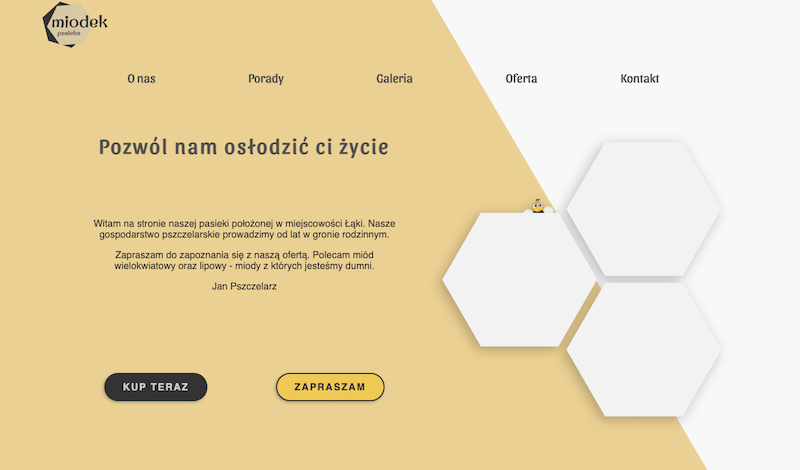
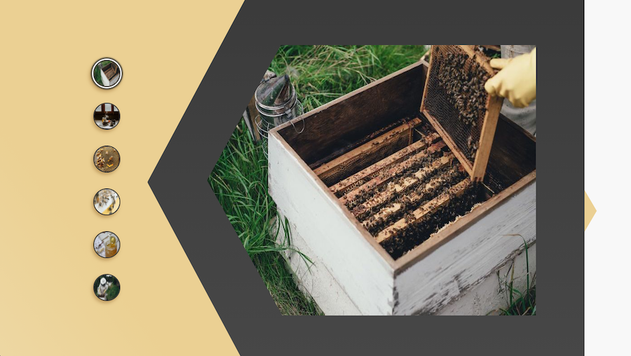
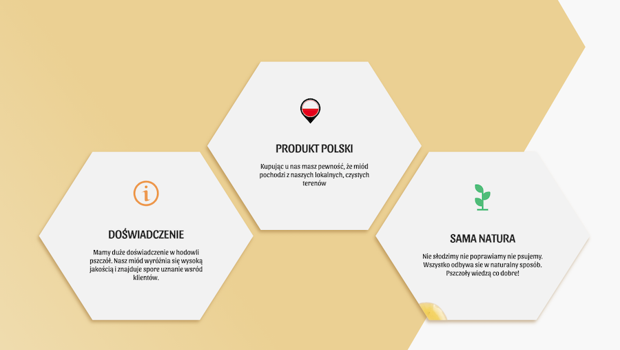
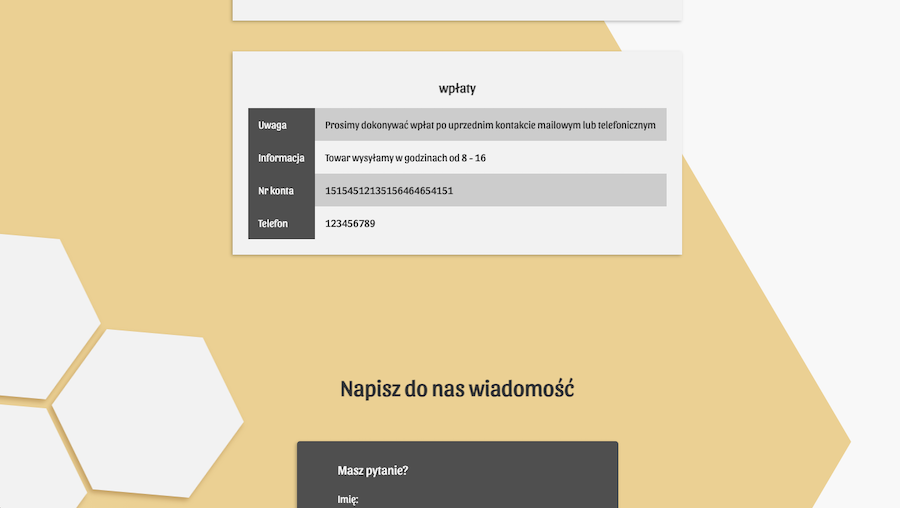

# Miodek v2

Fully accessible and responsive One Page website build with advanced CSS layout, which I implement thanks to Jen Kramer course on Frontend Masters.

## Features

- responsive-data-tables
- pure CSS off-canvas menu
- fully responsive,
- fully accessible,
- innovative CSS layout
- etc.

## Under the hood

Technologies being used under the hood:

- Node
- Vanillia JS
- Sass
- ESLint

## Screenshots

### License

MIT

---

Made with [@gregsypek](https://twitter.com/@gregsypek) 2021
